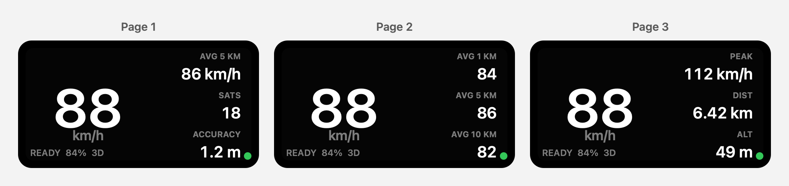

# DragyDash ESP32

Experimental LilyGO T-Display-S3 firmware for showing live Dragy Pro speed and GNSS quality over Bluetooth LE.

The display is intentionally simple: large live speed on every page, with the smaller right-side metrics paginated by the board buttons.

> Unofficial project: DragyDash ESP32 is not affiliated with, endorsed by, or supported by Dragy or LilyGO. The Dragy BLE behavior is based on limited hands-on testing and may vary by device or firmware version.



## Display Pages

All values are metric only.

- **Page 1:** live speed, 5 km average, satellites, horizontal accuracy.
- **Page 2:** live speed, 1 km / 5 km / 10 km rolling averages.
- **Page 3:** live speed, peak speed, distance, altitude.

The firmware deliberately does not include 0-60 timing, 0-100 timing, lateral G, longitudinal G, imperial units, Wi-Fi, SD card logging, or settings screens.

## Controls

- Quick left button tap: previous page.
- Quick right button tap: next page.
- Long left button: reset in-memory stats, including averages, peak speed, and distance.
- Long right button: pause BLE scanning/disconnect; long right again resumes scanning.
- Hold both buttons: cycle display brightness through dim, medium, and high.

Controls are RAM-only. Power cycling also resets run stats and resumes scanning.

## What It Implements

- PlatformIO firmware for `lilygo-t-display-s3`.
- ST7789 170x320 display via TFT_eSPI.
- BLE client using NimBLE-Arduino.
- Dragy-style discovery by `FD00` service or `DRG*` name.
- `FD03` challenge response: `[a, b, a XOR b, a AND b]`.
- `FD02` notification stream reassembly for UBX NAV-PVT-like packets.
- NAV-PVT decoding for fix quality, satellites, altitude, horizontal accuracy, ground speed, and heading.
- `FD04` battery percentage parsing from observed status packets.
- Distance-based rolling averages with a compact 15 km segment buffer.
- No-fix samples excluded from distance, peak speed, and rolling averages.
- Connection/fix status states: `SCAN`, `WAIT GPS`, `BUSY?`, `STREAM`, and `PAUSED`.

## Documentation

- [Firmware behavior](docs/FIRMWARE_BEHAVIOR.md)
- [Hardware assumptions](docs/HARDWARE.md)
- [Build and flash commands](docs/BUILD_AND_FLASH.md)
- [Dragy BLE protocol notes](docs/DRAGY_PROTOCOL.md)

## Build

Requirements:

- Python 3
- PlatformIO Core

Project-local setup:

```bash
git clone https://github.com/jremick/dragy-dash-esp32.git
cd dragy-dash-esp32
python3 -m venv .venv
.venv/bin/python -m pip install --upgrade platformio
.venv/bin/pio run
```

If PlatformIO is already installed globally:

```bash
git clone https://github.com/jremick/dragy-dash-esp32.git
cd dragy-dash-esp32
pio run
```

## Flash

Confirm the serial port before flashing:

```bash
.venv/bin/pio device list
```

Flash to the confirmed ESP32-S3 port:

```bash
.venv/bin/pio run --target upload --upload-port <PORT>
```

Open a serial monitor:

```bash
.venv/bin/pio device monitor --port <PORT> --baud 115200
```

Do not flash unless the selected port is clearly the intended LilyGO T-Display-S3.

## Hardware Notes

Target board:

- LilyGO T-Display-S3
- ESP32-S3
- ST7789 170x320 display
- two physical buttons

The current pin assumptions are documented in [Hardware assumptions](docs/HARDWARE.md). Verify your board revision before relying on the pin map.

## Runtime Expectations

The ESP32 connects as a BLE central. If the official Dragy app or the iOS DragyDash app is already connected, the Dragy may reject or stall the ESP32 connection. The firmware shows `BUSY?` or `STREAM` when it connects but telemetry does not start or later stops.

## Safety

Do not interact with the display while driving. Mount the display securely, obey local road laws, and verify speed against safe/legal instrumentation before relying on any displayed value.

This firmware is experimental and should not be used as the sole source of speed, vehicle state, or compliance information.

## Privacy

Public issues should not include raw BLE captures, full Dragy identifiers, route traces, or serial logs that expose a unique device. Use redacted examples only. See [SECURITY.md](SECURITY.md).

## License

[Apache License 2.0](LICENSE).
